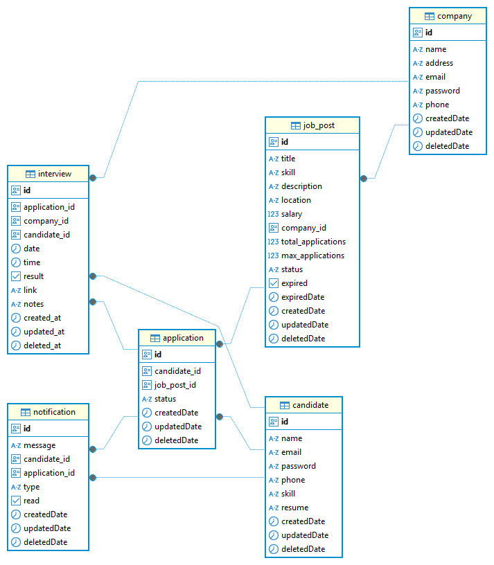

# Hiring Platform API

A modern, scalable hiring platform built with [NestJS](https://nestjs.com/), TypeORM, and PostgreSQL. It supports company and candidate management, job postings, interview scheduling, notifications, and more.

---

## Folder & Module Pattern

This project follows a **modular folder structure** inspired by best practices in NestJS and scalable backend development:

- **`src/common/`**: Contains shared utilities and services (e.g., mailer, logger, cron jobs, Redis) that are used across multiple modules.
- **`src/models/`**: Each business domain (such as `auth`, `candidate`, `company`, `interview`, `job-post`, `application`, `notification`) is organized as a separate module. Each module typically contains:
  - `entities/`: TypeORM entity definitions for database tables
  - `dto/`: Data Transfer Objects for validation and API contracts
  - `service.ts`: Business logic
  - `controller.ts`: API endpoints
  - `module.ts`: Module declaration for dependency injection

This structure:
- Promotes separation of concerns and code reusability
- Makes it easy to maintain, test, and scale the application
- Allows teams to work independently on different modules without conflicts

---

## Features

- **Authentication & Authorization**: JWT-based, with role support for candidates and companies.
- **Job Posts**: Companies can create, update, and expire job posts (with automatic cron for expiry).
- **Applications**: Candidates apply to jobs and track their status.
- **Interview Scheduling**: Companies schedule interviews; candidates can view their interview schedule.
- **Interview Results**: Companies update interview results, triggering notifications and emails.
- **Notifications**: Candidates receive in-app notifications and email updates.
- **Cron Jobs**: Automated job post expiry based on set dates.
- **Clean API**: RESTful endpoints, DTO validation, and Swagger documentation.

---

## Entity Relationship Diagram (ERD)



---

## Getting Started

### Prerequisites
- Node.js (v16+ recommended)
- PostgreSQL

### Installation
```bash
npm install
```

### Environment Setup
Copy `.env.example` to `.env` and fill in your database, JWT, and mail settings.

### Running the App
```bash
# development
yarn start:dev
# or
npm run start:dev

# production
npm run start:prod
```

### Database Migrations
```bash
npm run typeorm migration:run
```

### API Docs
Visit `http://localhost:3000/api` for Swagger documentation after starting the server.

---

## Folder Structure

```
src/
  common/                   # Shared utilities and cross-cutting concerns
    app-logger.ts           # Custom logger service
    cron/                   # Scheduled/cron jobs (e.g., jobpost expiry)
    mail/                   # Email service and templates
    redis.service.ts        # Redis caching service
  models/                   # Main business logic and domain modules
    application/            # Job application logic
      entities/             # TypeORM entities for applications
      dto/                  # Data Transfer Objects for validation
      application.service.ts
      application.controller.ts
      application.module.ts
    auth/                   # Authentication logic
      auth.service.ts
      auth.controller.ts
      auth.module.ts
      guards/               # Auth guards (e.g., JWT)
    candidate/              # Candidate user logic
      entities/
      dto/
      candidate.service.ts
      candidate.controller.ts
      candidate.module.ts
    company/                # Company user logic
      entities/
      dto/
      company.service.ts
      company.controller.ts
      company.module.ts
    interview/              # Interview scheduling and results
      entities/
      dto/
      interview.service.ts
      interview.controller.ts
      interview.module.ts
    job-post/               # Job posting logic
      entities/
      dto/
      job-post.service.ts
      job-post.controller.ts
      job-post.module.ts
    notification/           # Notification logic
      entities/
      dto/
      notification.service.ts
      notification.controller.ts
      notification.module.ts
```
- Each module typically includes: `entities/` (ORM models), `dto/` (validation), service, controller, and module files.
- The `common/` folder contains shared services (mail, cron, logger, redis, etc.) used across modules.

---

## Contributing
Pull requests are welcome! Please open issues for suggestions or bugs.

---

## Contributors

<table>
  <tr>
    <td align="center">
      <br/>
      <b>Hanif Maghfur</b><br/>
      <sub>Creator & Main Developer</sub>
    </td>
  </tr>
</table>

---

## License
MIT
